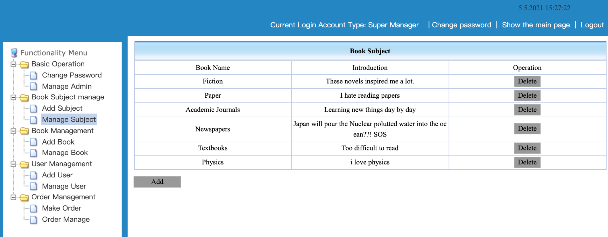

# Book Ordering System - JSP
***431W final project***  

## Introduction
This book ordering system is based on JSP/Servlet.  
Used MySQL, java, jsp, html/css/js

## Running the program  
1. Connect your database
2. Open the server like tomcat, use ide like eclipse or IDEA to inport the project and then build the project
3. Access the webpage from localhost:xxxx/book_manager

## DataBase Design
This project is just a demo, and you could make any changes you want. My sql file is called. jsp_book.sql, and I put it on the root.  
* t_book - The table stores the id, name, author, publisher, publication time, isbn, price, pages, stock, catagory, language, etc.
* t_catalog - The table stores the category name, brief introduction, etc.
* t_comment - The table stores the short text comment, comment score, user id, etc.
* t_customer - The table stores the customer's id, name, pw, age, address, tel, email, etc.
* t_manager - The table stores the manager's id, name, pw, etc.
* t_order - The table stores the order id, order num, order time, etc.

## Functionalities Implemented
* Log in, assigned default account is admin, and the default pw is admin.
  * If not input the account, alert suggesting to input the username
  * If not input the pw, alert suggesting to input the pw
  * If account and pw not match, alert wrong account or wrong pw
* Change Password
  * If the user just logged in, the login name and the original pw part are prefilled.
  * One change button to confirm changes, and one reset button to reset all the changes the user made.
  * If the user input a wrong original pw, alert wrong pw.
  * If the user doesn’t input a pw in New password text box, alert new pw cannot be null.
* Manage Admin
  * Normal user cannot see the Admin Management page, but the super manager can see it. It shows all the manager’s account name, their corresponding password, and their corresponding roles.
  * The super manager can choose to delete one of the records by pressing the delete button.
  * The super manager can add a new customer or a super manager by pressing the add button, input a new account and pw, and select a role.
* Book Subject Management.
  * Only manager can see this section.
  * Add subject
    * Manager can input a new classification of a book such as fiction or textbooks. 
    * Manager can also input some introduction from the text box and press submit. Then the database table will store the new added classification with a short introduction.
    * The manager can also click the reset button to reset all the changes he made.
  * Manage subject
    * The manager can look at the subject table with its name along with a short introduction.
    * The manager can click the delete button to delete a classification from the database.
* Book Management
  * Only manager can see this section
  * Add book
    * The manager can input all the necessary entries to add a new book.
    * If the manager click the reset button, reset all the entries. Click the submit button, insert to the database.
  * Manage Book
    * The manager can see a table which shows all the books existed in the database.
    * In the right part of the table, the manager can click the delete button to delete one book record, or click the change stock button to change its stock.
    * In down left part of this page, there is a add button and it can redirect the manager to the add book page.
    * In the down middle and the down right part of this page, the manager can click the next button to go to the next page, or click on the back button to go back the previous page, or click the Front page button to go to the first page, or lick the last button to go to the last page, or input a number and click the page transfer and go to the specific page the manager wants to go.
    * In this part, manager can also see how many records are there in total, and which page the manager are currently located at.
* User Management   
Both the normal customer or the super manager can see this section.
  * Add User
    * The users can input all the information there. After the user inputs a login name and a corresponding pw, some parts of the records will store in the admin table and another part of the records will store in the customer table. 
    * The new added customer will be given a normal user role by default. (Only the manager can assign a super manager role in Manage Admin section.)
  * Manage User
    * The users can view all the other users’ information from this page. 
    * This page will show all the things about a user instead of its password.
    * The users can delete one of the user from the table. 
    * There is also a add user button, similar to the previous one, can redirect the user to the add user page.
    * There is also some buttons and texts redirect to other page and shows the current page information.
* Order Management  
Both the normal user and the super manager can access this functionality.
  * Make Order
    * The user can input corresponding information to make an order.
    * The user can click the choose button and get redirected to another page to choose which user to choose. Click the right part operation circle, and then click confirm button in down left side. After confirming, the user can see the corresponding name and the user’s user id.
    * The user can then click the select button and get redirected to another page to choose which book to read. After clicking the circle on the right and pressing confirm button, the user can see the book name and its book id shows up on the table.
    * Then the user can input a quantity and an order time. There are also one confirm button and a reset button.
  * Order Manage.
    * The user can view who ordered which book, how many at which date this order is being made.
    * The user can also delete records by pressing the delete button.
    * One add button to redirect to make order page and some text showing the current page.
* In top right, there is a clock showing the current date and a current time.
* On the down side, one side shows the Current Login Account Type, and one side shows the change password functionality, one side can hide the left main page or unfold it, and the last side performs a logout functionality.
* Hiding the main page is useful when the user wants to see more information on the tables such as staying on order manage section for a while to find a specific order record.

## Functionalities Preview  

The flow chart  

  

The login page  

  

Change Password  

  

Manage Managers  

  

Add Subject  

  

Manage Subject  

  

Add Book  

  

Manage Book  

  

Add Customer 

  

Manage Customer  

  

Make Order when choosing customer 

  

Make Order When selecting book  

  

Manage Order  

  

Log Out  

Customer View - Only three sections available  

  

Add Manager/Customer under Manager mode  

  

## Author
*  Jialong6
